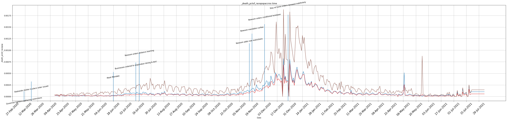
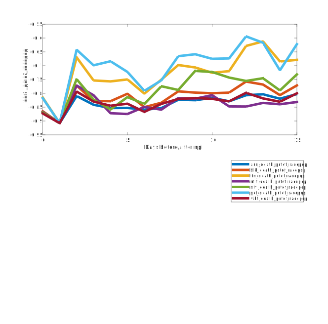
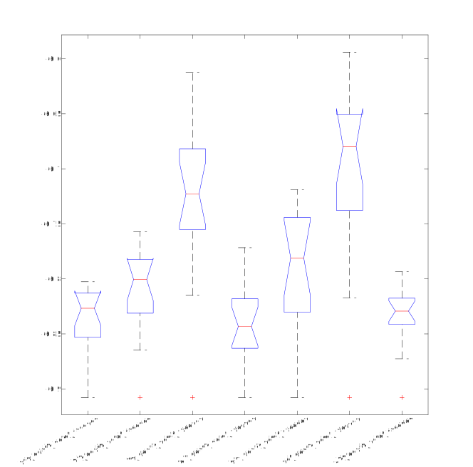
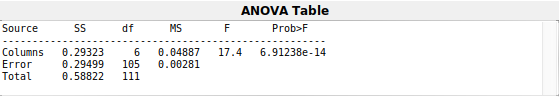

# To Do and Ideas

Analysis

- Write python code for akshita
- Anova Code in Python
- Akshita assignment: 
   - fix plots using power point or illustrator
   - finish writing methods and results
   - Begin outlining and writing conclusion/discussion
   - prepare formating for publication 

# Introduction

The problem

Hypothesis...

Figure of NPI policies

# Methods

## Data 

<u>Covid death data and race data</u> 

We use a publically available dataset provided by the California Departmet of Health [**REFERENCE**]. The data set contains

-  daily counts of **DV_RAW** accross time begining on **START DATE** and ending on **END DATE**
-  Data is obtained for N different ethnic groups: White, African American,..., Latino and Asian.
-  For the analysis, **DV_RAW** is converted to a percentage by dividing **DV_raw** with the etihnic group's total population size in California. We refer to this outcome variable as **DV**.
   - The population size of each ethnic group's is taken from [**reference** for county 1 2 3]. These population counts are estimates from the census counts in 2019. 
-  **DV** is smoothed using a moving average of 7 days.

Figure () shows the **DV** accross N days, for each ethnic group considered in this analysis. 

<u>NPIs</u>

- Are primary interest is to assess how ethnic populations are impacted by non-pharemcutical interventions (NPIs) impact. We define NPIs as government policies that impose restictions on social and economic activity accross the state of California. 
- In the analysis, we use N NPIs occuring between **start date** to **end date**  [**reference**]. These NPIs are aquired from **this reference**.
   - An example NPI was implemebted on **DATE**, where the state of california imposed a mask mandate reqiuring, by law, all of its residents to wear a mask when out doors.

The vertical lines in **Figure ()** reveal the dates a short description of the NPIs used in this report. 

## Analysis 

To determine the effect of non-pharemcutical interventions (NPIs) on the **DV** of each ethinic group, we ask how much **DV changed** following the onset of an NPI.  Specifically, after each NPI, we compute change in the **DV** for D days following the NPI. We then take the average of the change in the DV accross the D days and accross all NPIs. We refer to this final value as **dY**. dY was computed seperately for each ethnic population. 

$$

$$

$$
{\Delta}\bar{Y}{_{race}} =  \dfrac{1}N\sum_{n=1}^{N}{  {\Delta}{y_n} }
$$

$$
{\Delta}{y_n} = \dfrac{1}D\sum_{i=1}^{D}(y_{d_0} - y_{d_i})
$$

# Results

The results are summarized in figure [X]. 

## ANOVA

We begin by testing the hypothesis that the **average change in DV** following an NPI is similar for all ethnic groups. Using a one way anova test, we reject this hypothesis  [ F(6,105) = 17.40, p = 0.00]. 

## T-Tests

Second we ask if minority ethnic groups (Latinos,..., and native Americans) are impacted by NPIs as Whites are. As shown in **FIGURE X**

- we find a significant difference in the **DV**  for whites versus latinos (t = x.xx, p = x.xx). 
- Similarly, we find that, following an NPI, the **DV** of whites is smaller than the following ETHNIC GROUPS, whites and ETHNIC group and whites  

# Discussion

Limitations

- no baseline measurment

- only 1-2 npis are being assessed. this may not be enough data.

  

