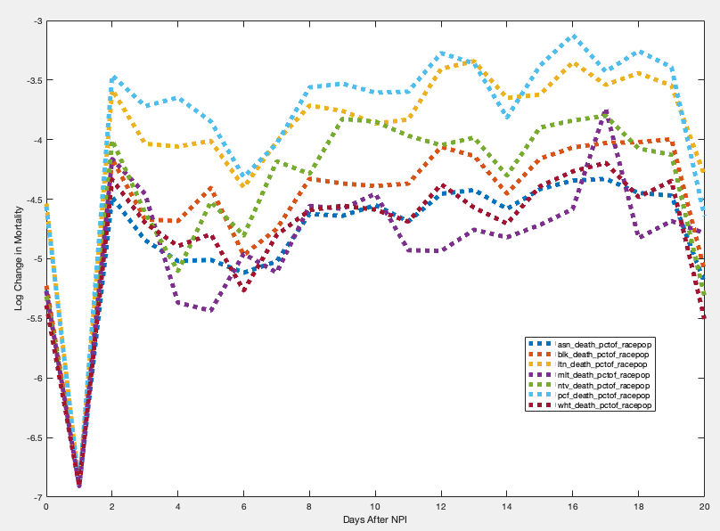
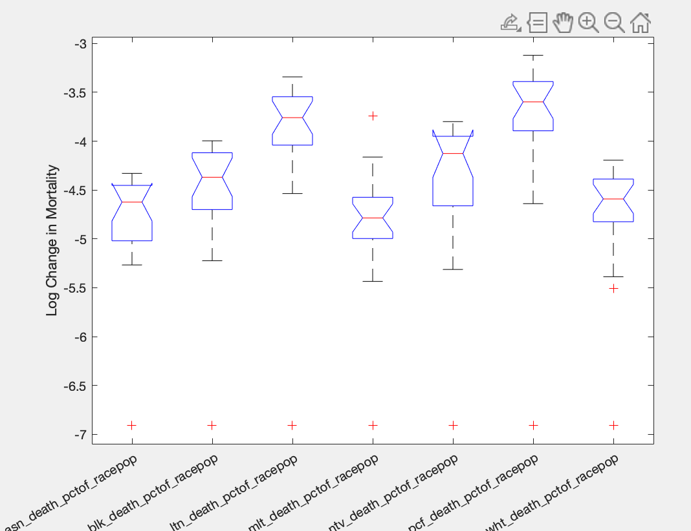
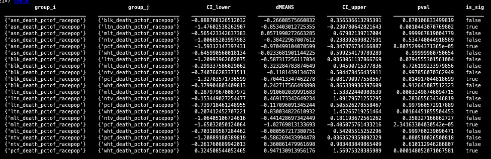

# To Do and Ideas

Introduction

The problem

> "Comparing the trajectory of the COVID-19 epidemic in the United States to that of other countries can provide important insights into how the virus is progressing in the United States and the effectiveness of our response"
>
> Elvery 2020

Hypothesis...

Figure of NPI policies

# Methods 

## Raw Daily Mortality Counts

We use a publically available dataset provided by California's Covid19 Recourse Website (https://covid19.ca.gov/state-dashboard/). From the data set we used the 

-  Daily number of covid-related mortalities begining on **April 2020** and ending on **July 2021**
-  We obtain daily mortality counts obtained for **7** different ethnic groups: Asian, African American, Latino, multi-ethnic, Native-American, Pacific-Islander and White.

## Daily Death Rates

Motivation

- Daily number of mortalities for a given ethnic group will be much larger for groups with a large population, and is therefore an inappropriate measure for comparing **mortality** between different ethnic groups.

Solution

- To resolve this issue we divide the mortality count on the *i_th* day by the group's population size in California. We refer to this outcome variable as the **daily *mortality rate*** of an ethnic group.

$$
m_{d_i} = NumberOfMortalities/EthnicPopulation
$$

- Each ethnic group's population size in the California was taken from 2019 census counts conducted by the [United States Census Bureau](https://data.census.gov). 

-  **Daily mortality rates** are smoothed using a moving average of 7 days.

[Figure X](this) shows each ethnicity's **daily mortality rates** from April 2020 - July 2021. 

## NPI

We also aquired the dates that non-pharemcutical interventions (NPIs) were implemented by the state of California. Specifically, we define **NPIs** as government policies that impose restictions on social and economic activity accross the state.

In this analysis we assess the impact of **7** NPIs occuring between April 2020 and July 2021. An example NPI is one implemented on **DATE** where the state of California imposed a mask mandate reqiuring all of its residents to wear a mask when outdoors.

Data on NPIs are manually collected from a report written by Richard Procter. The [website to the report can be found here](https://calmatters.org/health/coronavirus/2021/03/timeline-california-pandemic-year-key-points/), and a PDF of the report used used in this analysis can be [found here](aksPAPERS/2021Procter_Timeline_ NPIs.pdf).

The vertical lines in **Figure ()** show the dates a short description of the NPIs that were used in this analysis. 

## Analysis 

To determine the effect of non-pharemcutical interventions (NPIs) on the **daily** **mortality rate** of an ethinic group, we compute the **average change in the mortality rate** following the onset of NPIs for each ethinic group.  Specifically, after the onset date of an NPI we assess the difference between 

- the mortality rate on the day of the NPI
- and the mortality rate for each day following the NPI for up to 15 days. 

We then average the changes in mortality rates accross the 15 days and accross all NPIs. This NPI-induced **change in the mortality rate** was computed seperately for each ethnic population. 

$$
{\Delta}\bar{M}{_{ethnicity}} =  \dfrac{1}N\sum_{n=1}^{N}{  {\Delta}{m_{n}} }
$$

$$
where, {\Delta}{m_n} = \dfrac{1}D\sum_{i=1}^{D}(m_{d_0} - m_{d_i})
$$

# Results

The results of the analysis are summarized in figure [X]. 

## ANOVA

We begin by testing the hypothesis that the **mean change in mortality** following an NPI is similar for all ethnic groups. Using a one way ANOVA we choose to reject this hypothesis  [ F(6,105) = 17.40, p = 0.00].

## T-Tests

Second we ask if minority ethnic groups and Whites are impacted by NPIs to the same degree. 

As shown in **FIGURE X**

<u>*Significant Differences</u>*

- We find a significant difference in the **change in mortality** between whites and latinos after NPIs (t = x.xx, p = x.xx). 
- Furthermore, we also find a significant difference in the **change in mortality** between whites and Pacific Islanders after NPIs (t = x.xx, p = x.xx). 

<u>*NonSig Differences</u>*

- In contrast, we find that, following an NPI, the change in mortality for whites is similar to that of Asians
- Furthermore, Whites and African Americans (t = x.xx, p = x.xx),  Whites and Multi-ethnic groups (t = x.xx, p = x.xx), and Whites and Native Americans, all showed similar changes in mortality after the onset of NPIs.

# Discussion

### Findings

<u>Discuss: ALL Racial Groups that did not benefit as much as whites: Latinos, Pacific Islanders, native Americans, african Americans</u> 

Findings

- We found that following an NPI, the death rate for Latinos, Pacific Islanders, native Americans, african Americans  increased more than the death rate for whites.

Elaborate

- This suggests that NPIs benefited whites more than the minority groups. 

- Why does this happen. Restate your introduction and hypothesis. 
   - government policies are no effectively communicated with minority groups
   - some minority cultures hold negative views of health care system 
   - Due to pverty. minorities are more likely to live in households with alot people 
   - kind of employment (close contact employment), mandatory work (can work from home as high income population)

<u>Discuss:  Racial Groups that benefited poorly: Latinos Pacific Islanders</u> 

Findings

- Out of all minoity groups, Latinos and Pacific Islanders death rates increased much more than Whites. 

Elaborate

- why do NPIs not impect latinos and pacific islanders as much

<u>Discuss:  Racial Groups that benefited from NPIs as much as whites (Asians)</u>

Findings

- We found that following an NPI, death rate for asians whites changed in a similar manner as whites.

Elaborate

### Limitations

- Only used 7 npis are being assessed. this may not be enough data.
- Use of death rates may not be ideal (maybe we could have used transmisablity measure)
- we only compared the death rates between racial groups, but we did not assess the overall effictively of the NPI. 

### Next steps

- Within county analysis, because maybe inequalities exist in certain counties, or other areas of the united Staes, but not others
- Assess different age groups within each ethnicity 

